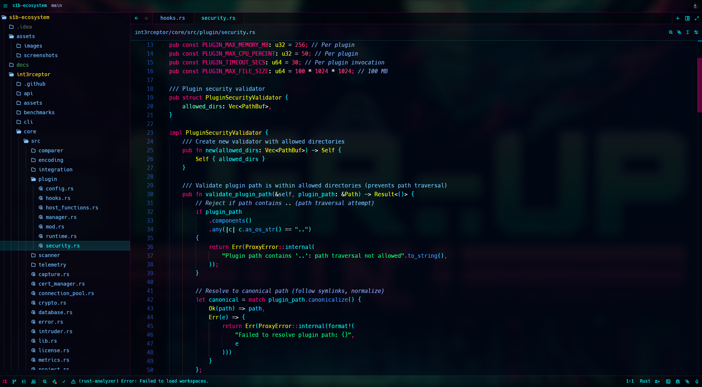

# ZedPhantomUI

Cyberpunk glassmorphism themes for Zed editor with blur effects.



## Themes

- **Phantumbra Neon Cyberpunk [Dark]** - Main blur theme
- **Phantumbra Cyber Light [Light]** - Light variant 
- **Phantumbra Deep Blur [Dark]** - Maximum blur

## Install

```bash
./themes/install.sh
```

Or manual:
```bash
cp themes/zed/*.json ~/.config/zed/themes/
```

## Usage

Add to `~/.config/zed/settings.json`:
```json
{
  "theme": "Phantumbra Neon Cyberpunk [Dark]"
}
```

## Colors

- **Primary**: `#00f5ff` (Cyan)
- **Accent**: `#ff0080` (Pink) 
- **Background**: `#000817bb` (Dark blur)
- **Syntax**: Neon cyberpunk palette

## S1B Team

Red team security-focused development tools.
